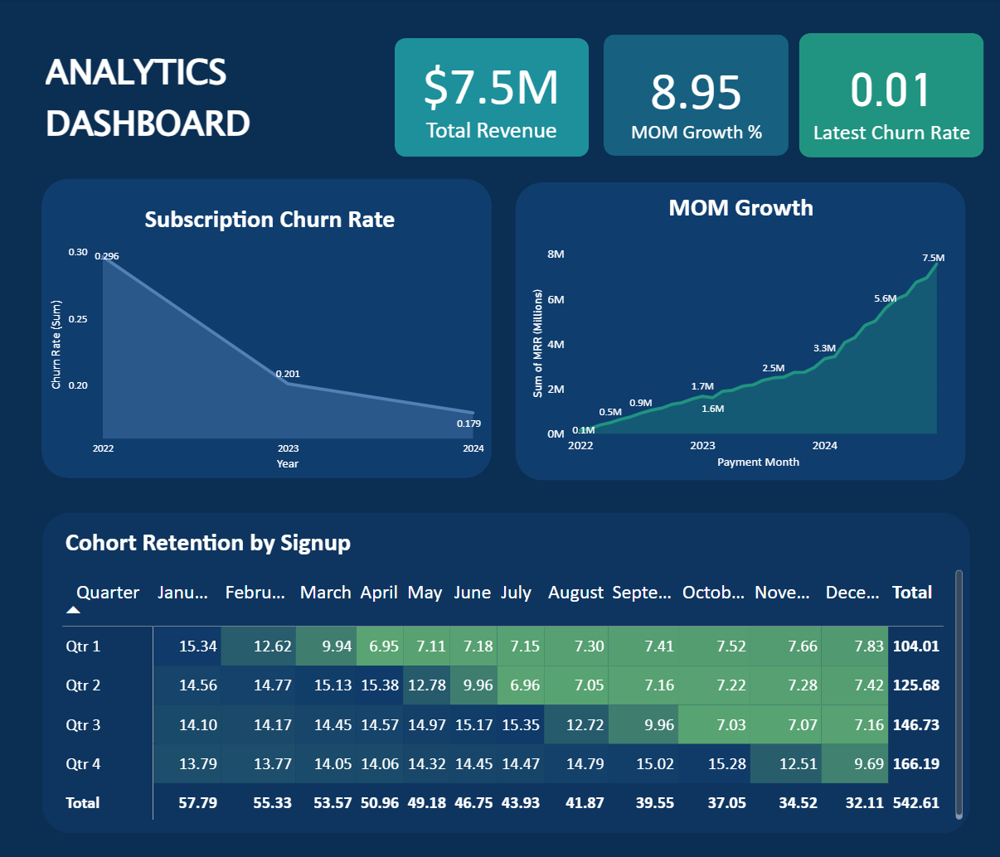

# SasS dbt Analytics Engineering Project

## Overview
This project transforms raw e-commerce transactional data into analytics-ready dimensional models, enabling business intelligence analysis of customer behavior, product performance, and revenue metrics.

## Business problem that need to be addressed:
- What is the month-over-month revenue growth?
- Which customer segments drive the most value?
- What are the cohort retention rates?
- How is product performance trending?
- What is the customer churn rate?

## Technology Stack
- **Data Warehouse:** Snowflake
- **Transformation:** dbt Cloud
- **Languages:** SQL, YAML
- **Version Control:** Git, gtiHub

## Data Architecture

### Layer Structure
The project follows the medallion architecture with four layers:

**1. Raw Layer** (`ecommerce_analytics.raw`)
- Source system data loaded directly into Snowflake
- Tables: `raw_customers`, `raw_orders`, `raw_invoices`, `raw_payments`, `raw_subscriptions`

**2. Staging Layer** (`staging/`)
- Light transformations: renaming, type casting, basic filtering
- One-to-one mapping with source tables
- Standardized naming conventions

**3. Intermediate Layer** (`intermediate/`)
- Business logic and complex joins
- Reusable transformations
- Customer metrics, order aggregations, cohort assignments

**4. Marts Layer** (`marts/`)
- Dimensional model (star schema)
- Fact tables: `fct_paymnets`, `fct_subcriptions`
- Dimension tables: `dim_customers`, `dim_products`, `dim_dates`
- Analytics aggregates: `mrr`, `cohort_retention`, `churn`

### Dimensional Model (Star Schema)

**Fact Tables:**
- `fct_orders` - Grain: One row per order
  - Keys: order_id, customer_id, order_date
  - Metrics: total_price, total_quantity, unique_products

**Dimension Tables:**
- `dim_customers` - Customer attributes and calculated segments
- `dim_products` - Product catalog with performance metrics

### Key Models Explained

**`mrr.sql`**
Calculates Monthly Recurring Revenue with growth metrics:
- Uses window functions (LAG) to calculate month-over-month growth
- Handles new, expansion, and churned MRR components
- Enables revenue forecasting and trend analysis

**`cohort_retention.sql`**
Customer retention analysis by signup cohort:
- Groups customers by signup month
- Tracks monthly retention rates
- Uses window functions for cohort analysis

**`churn_analysis.sql`**
Churn rate calculations by segment:
- Identifies churned customers (no orders in 90+ days)
- Calculates churn rate by customer segment
- Enables proactive retention strategies

## Design Decisions

### Why Order-Level Grain for Fact Table?
Chose order as the grain (not order-line-item) because:
- Most business questions are order-centric
- Reduces fact table size by ~70%
- Simplifies queries for BI tools
- Line-item detail still available in intermediate layer when needed

### Why Separate MRR, Churn, and Cohort Models?

Could have built one large analytics model, but separated for:
- Modularity: Each answers distinct business questions
- Performance: Users query only what they need
- Maintainability: Easier to update individual metrics

## Sample Analytical Queries

**Monthly Revenue Trend:**
```sql
SELECT 
    order_month,
    total_revenue,
    mom_growth_pct
FROM mrr
ORDER BY order_month DESC
LIMIT 12;
```

```

**6-Month Cohort Retention:**
```sql
SELECT 
    cohort_month,
    months_since_first_order,
    active_customers,
    retention_rate
FROM cohort_retention
WHERE months_since_first_order <= 6
ORDER BY cohort_month, months_since_first_order;
```
```

## Data Quality & Testing

The project includes comprehensive tests:
- **Uniqueness tests:** Primary keys in all tables
- **Not null tests:** Critical fields validated
- **Referential integrity:** Foreign key relationships validated
- **Accepted values:** Status codes, categories validated
- **Custom tests:** Business logic validation (e.g., MRR >= 0)

Run tests with: `dbt test`

## Key Learnings

**Technical:**
- Dimensional modeling requires careful grain decisions
- Window functions are essential for time-series analysis
- dbt's ref() function creates automatic dependencies
- Testing early catches data quality issues

**Business:**
- MRR calculations must handle subscription lifecycle complexity
- Cohort analysis reveals retention patterns not visible in aggregate
- Customer segmentation enables targeted strategies
- Churn prediction requires defining "active" customer threshold

## Project Stats

- **Models:** 15+ transformation models
- **Tests:** 30+ data quality tests
- **Lines of SQL:** ~800
- **Build Time:** ~45 seconds full refresh

## 📊 Dashboard (Power BI)



**Metrics shown:**
- Monthly Recurring Revenue (MRR)
- MoM Growth
- Subscription Churn
- Cohort Retention

